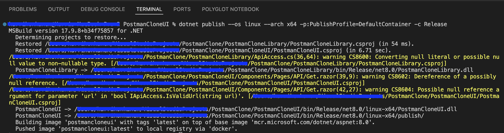
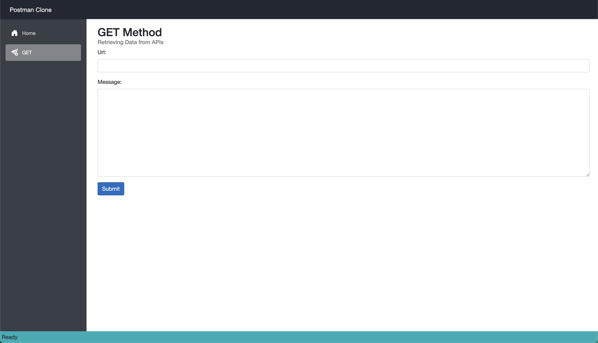
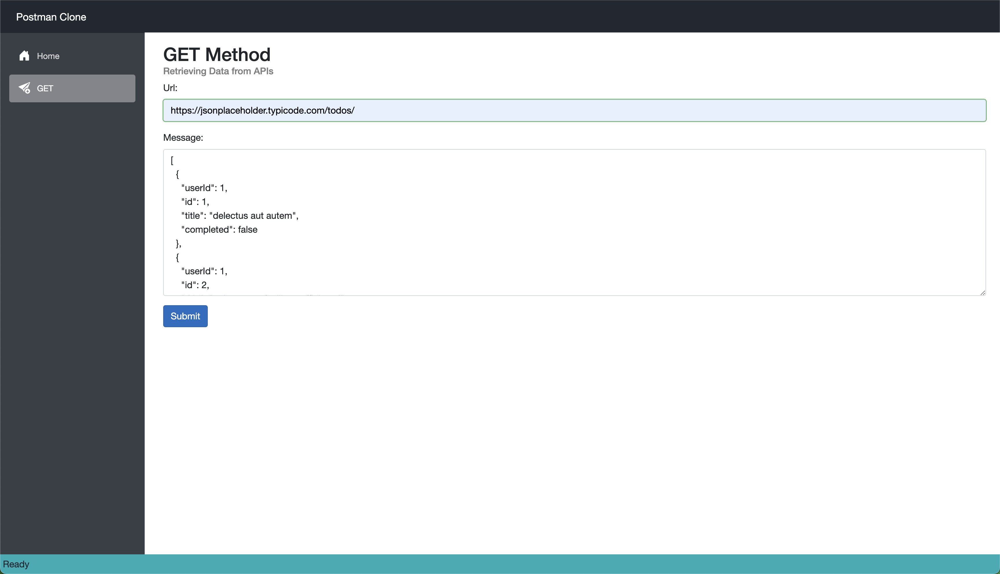

# Postman Clone
- Blazor Web App for API calls
- Targeted to run from a Docker container

This app provides a user-friendly interface for making GET requests to to APIs and viewing the responses in formatted JSON. Ideal for developers and testers. This tool simplifies API interaction and debugging, helping you efficiently validate and troubleshoot your API calls. 

## Technologies Used
* C#
* .NET 8
* Blazor Web App
* HttpClient

## Using The App
1. Clone the repository
2. Run from terminal: "dotnet publish --os linux --arch x64 -p:PublishProfile=DefaultContainer -c Release"

3. Run your docker image
4. When the application launches, it should look like this

5. Fill in your API URL and hit Submit

## Upcoming Changes
* Adding POST, PUT, PATCH and DELETE functionalities
* Adding API headers
* Handling API authentication
* Adding Dependency Injection
* Adding Logging
